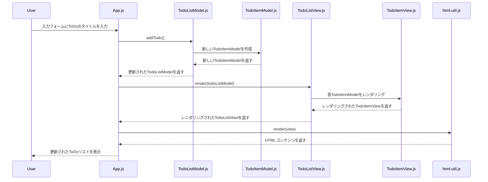

```mermaid
sequenceDiagram
    participant User
    participant App as App.js
    participant TodoListModel as TodoListModel.js
    participant TodoItemModel as TodoItemModel.js
    participant TodoListView as TodoListView.js
    participant TodoItemView as TodoItemView.js
    participant HtmlUtil as html-util.js

    User ->> App: 入力フォームにToDoのタイトルを入力
    App ->> TodoListModel: addTodo()
    TodoListModel ->> TodoItemModel: 新しいTodoItemModelを作成
    TodoItemModel -->> TodoListModel: 新しいTodoItemModelを返す
    TodoListModel -->> App: 更新されたTodoListModelを返す
    App ->> TodoListView: render(todoListModel)
    TodoListView ->> TodoItemView: 各TodoItemModelをレンダリング
    TodoItemView -->> TodoListView: レンダリングされたTodoItemViewを返す
    TodoListView -->> App: レンダリングされたTodoListViewを返す
    App ->> HtmlUtil: render(view)
    HtmlUtil -->> App: HTMLコンテンツを返す
    App -->> User: 更新されたToDoリストを表示
```